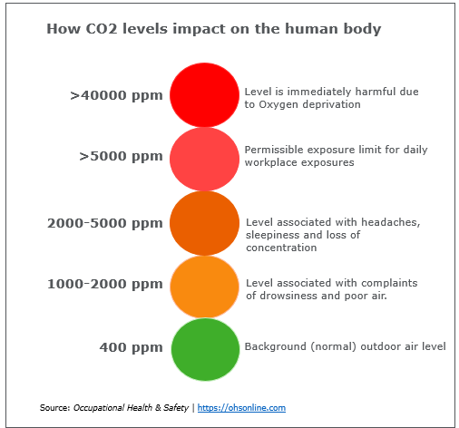
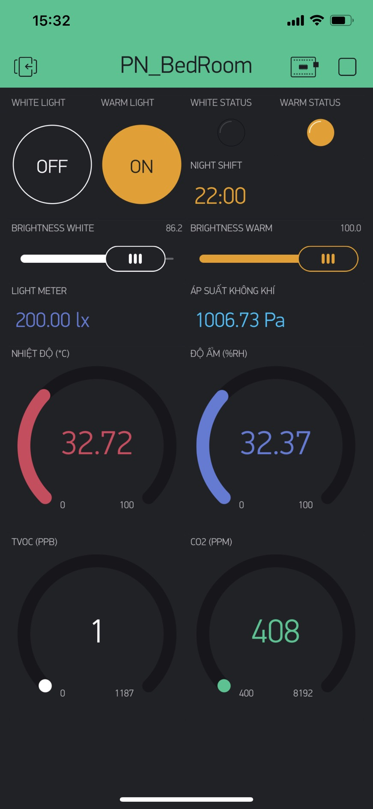
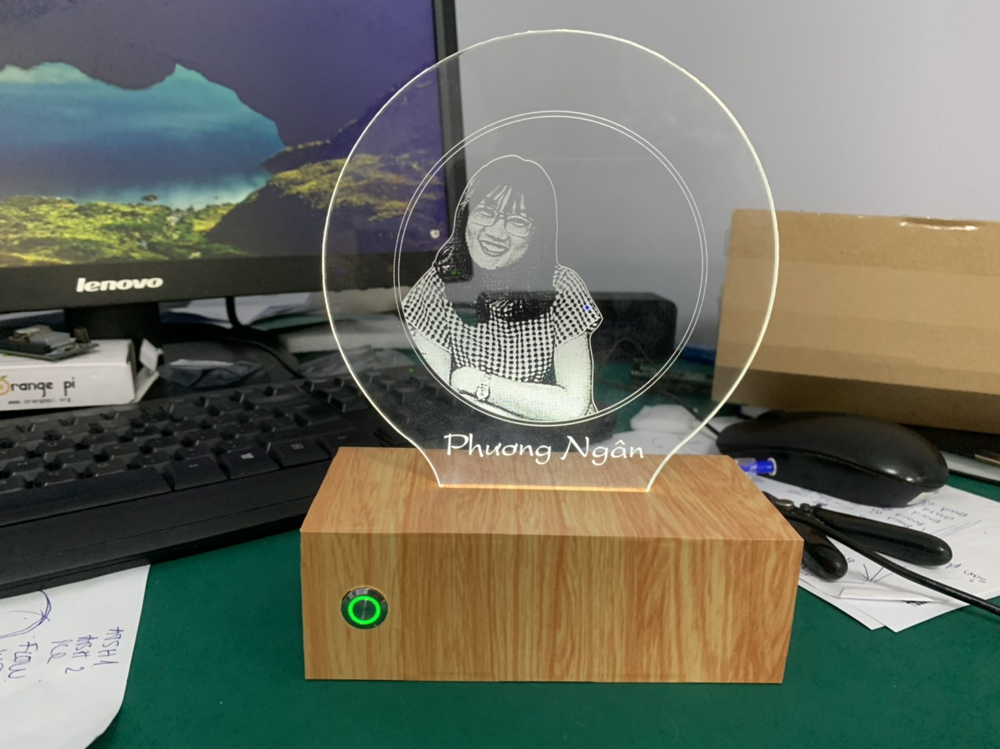
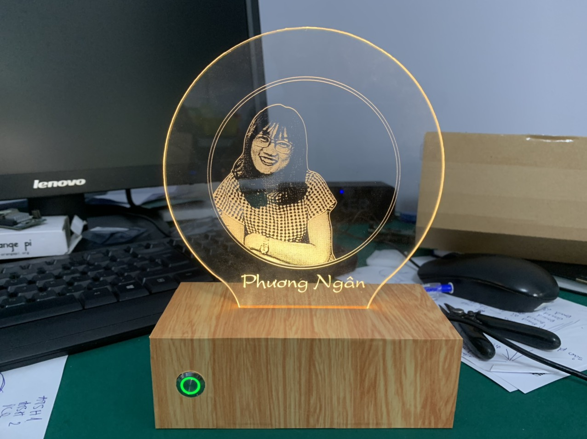
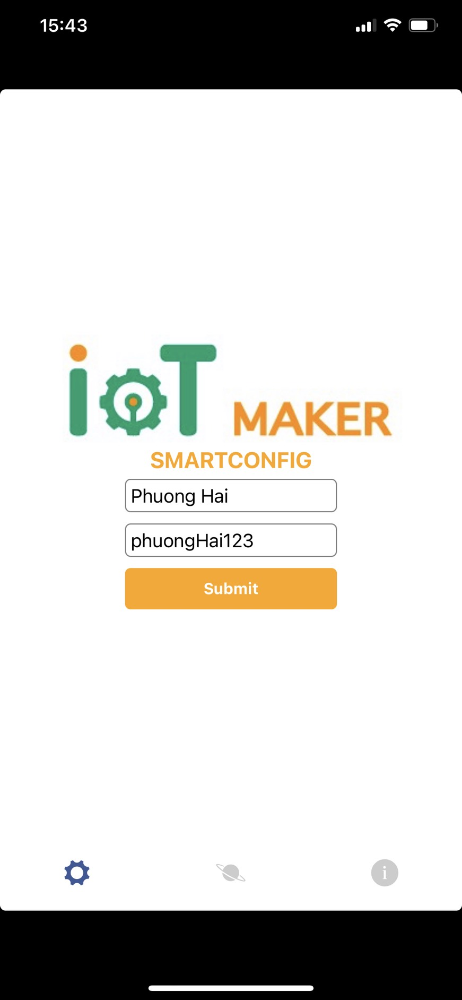
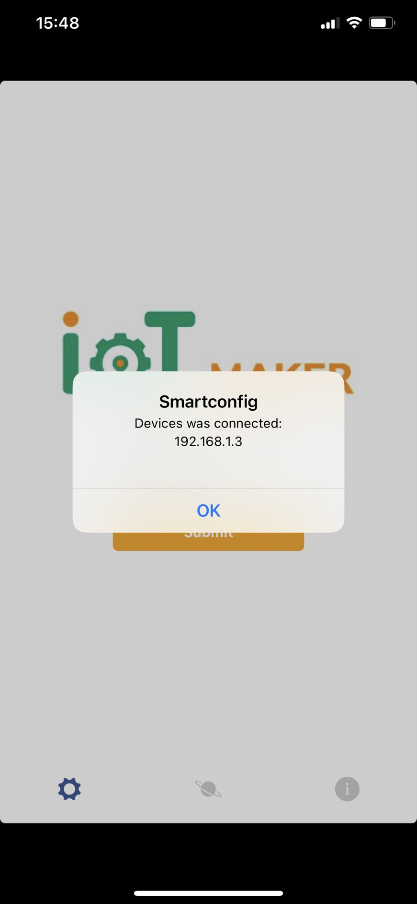

# PN BEDROOM DESCRIPTION

## Description
#### Hệ thống đèn ngủ (tính năng NightShift) tích hợp theo dõi chất lượng không khí trong phòng ngủ. Theo dõi các chỉ số sau: nhiệt độ, độ ẩm, áp suất không khí, TVOC, ECO2, cường độ ánh sáng.

#### Giải thích các thuật ngữ, chỉ số

    - NightShift là chế độ giúp làm giảm ánh sáng màu xanh của đèn led điều chỉnh ánh sáng đèn về phía ẩm hơn của phổ màu cụ thể là màu trắng ấm (WARM) thay cho màu trắng sáng (WHITE). Màu ấm sẽ giúp dịu mắt hơn về đêm hoặc trong điều kiện ánh sáng yếu. Theo nghiên cứu khoa học, việc tiếp xúc ánh sáng xanh vào buổi tối khiến bạn khó ngủ hơn. Khi thiết lập khung giờ thì đến giờ đó chế độ nightshift sẽ được bật.
    - VOC: là cụm từ viết tắt của “Volatile Organic Compound” là tên gọi chung của các hợp chất hữu cơ dễ bay hơi. VOC hầu như tồn tại mọi nơi trong không khí. Một số vô hại cho con người, số còn lại nếu tiếp xúc nhiều sẽ gây ra các vấn đề liên quan đến hô hấp, hay mắt, mũi, cổ họng. Nặng hơn nữa có thể dẫn đến tổn thương các cơ quan bao gồm hệ thần kinh trung ương, gan và thận. Thậm chí, VOC còn được biết đến là chất gây ung thư mức độ cao khi tiếp xúc nhiều với thời gian lâu dài. Trẻ em và những người bị hen suyễn dễ bị tác động xấu từ hợp chất này. Vì vậy theo dõi nồng độ khí này trong phòng là cần thiết để đưa ra các giải pháp lọc không khí cho chất lượng không khí trong phòng tốt hơn.
    - CO2: đối với hầu hết mọi người, Carbon Dioxide (CO2) chỉ đơn giản là một loại khí vô hại mà bạn không thể nhìn thấy hoặc ngửi thấy. Đó là những gì chúng ta thở ra, những gì làm cho đồ uống của chúng ta có ga và những gì chúng ta có thể sử dụng để dập tắt đám cháy. Không khí bên ngoài (outside) thường chứa khoảng 400ppm (phần triệu) CO2. Trung bình con người thở ra môi trường xung quanh từ 35000-50000 ppm CO2. Trong khi CO2 thở ra được pha loãng tự nhiên trong không khí xung quanh thì trường hợp này không xảy ra trong một tòa nhà hoặc không gian kín, chẳng hạn như trong phòng ngủ, trong ô tô,... Khi nồng độ CO2 trong tòa nhà/phòng tăng cao dẫn đến tình trạng ngột ngạt khó chịu, nghiên cứu cho thấy khi tiếp xúc với carbon dioxide ở nồng độ 2500ppm - 4000ppm có thể tác động tiêu cực đến hiệu suất của con người, một số nghiên cứu cho thấy tác động trực tiếp đến nhận thức và ra quyết định của con người, gây mất tập trung đau đầu và buồn ngủ.

    - Nhiệt độ, độ ẩm, áp suất không khí: theo dõi các thông số cơ bản trong phòng.

#### Giao diện app điều khiển

    - bật/tắt từ xa qua internet đèn WHITE và đèn WARM bằng nút nhấn ON/OFF, status đèn hiển thị qua LED
    - Hẹn giờ chế độ NightShift
    - Điều chỉnh độ sáng đèn bằng thanh Slider
    - Theo dõi các thông số chất lượng không khí trong phòng 

#### Hình ảnh sản phẩm

  

  

## Specifications:
    - Nguồn cấp 12VDC (Adapter)
    - Sử dụng chip ESP32_WIFI
    - Sensor BME280 measure temperature, humidity, air pressure
    - Sensor CCS811 measure carbon monoxide, VOC
    - Sensor BH1750 measure light intensity
    - Mosfet control led light
    - Button and led indicator status connect wifi

## Hướng dẫn sử dụng

- Lắp tấm mica khắc ảnh lên hộp đèn
- Cắm jack cắm nguồn 12V từ adapter vào hộp đèn, cắm adapter vào nguồn điện 220VAC.
- Lên Appstore hoặc CHplay cài đặt 2 app: Smartconfig (IoT maker) và Blynk App
- Nhấn và giữ nút phía trước đến khi đèn xanh lá chớp nháy liên tục để vào chế độ wifi config. Cài đặt ứng dụng IoT Smartconfig để cấu hình wifi cho thiết bị. Giao diện như sau:

    

- Nhập tên wifi và password wifi vào sau đó bấm nút submit, đợi đến khi hiện lên thông báo địa chỉ IP và connected nhue hình, hệ thống sẽ lưu lại tên wifi và mật khẩu cho lần khởi động tiếp theo.

- Sau khi được kết nối wifi đèn led xanh sẽ sáng luôn báo trạng thái đã kết nối wifi. Mở app Blynk lên sử dụng bình thường:

Tên tài khoản: nhanttn92@gmail.com

Password:   nhantt1904

- Bình thường nếu không dùng app để bật tắt đèn có thể nhấn nút trên hộp đèn. Nhấn 1 lần đèn LED trắng sáng, nhấn 2 lần đèn Led trắng ấm sáng, nhấn 3 lần tắt hết. 